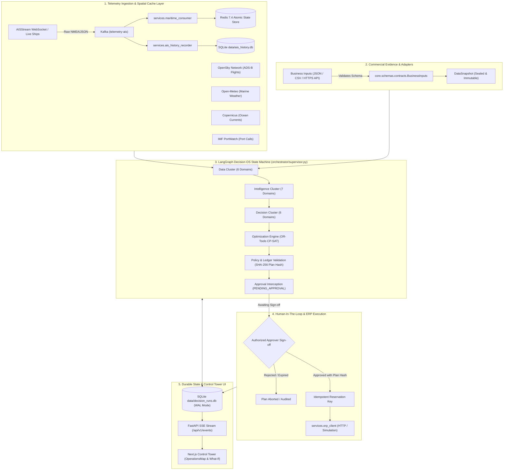

# ExoChain Decision OS: Architecture, System Design & File Specification

## 1. Executive Summary & Core Design Philosophy

**ExoChain Decision OS** is an evidence-driven, deterministic decision operating system designed for mission-critical supply-chain disruption response, multimodal freight routing, inventory replenishment, and procurement.

### Core Architectural Invariants

1. **Physical Signals ≠ Commercial Commitments**:
   Real-time AIS vessel coordinates, ADS-B flight vectors, marine weather, and port call telemetry are physical observations. They are **never** treated as customer orders, carrier quotations, navigational network edges, or budget sign-offs.
2. **Deterministic Mathematical Optimization**:
   Heuristics and LLMs generate candidate options, but final allocations are strictly decided by **Google OR-Tools CP-SAT** discrete mathematical solvers operating over verified constraints.
3. **Zero Floating-Point Drift**:
   Financial budgets, freight charges, and unit prices are strictly converted to **integer cents** ($\text{cents}(v) = \lceil v \times 100 - 10^{-8} \rceil$) before optimization to eliminate IEEE 754 floating-point inaccuracies.
4. **Immutable Snapshots & Cryptographic Binding**:
   Once a run ingests its data, the input snapshot is sealed. Every recommendation is bound to an immutable **SHA-256 plan hash** covering all raw inputs, intelligence assessments, candidates, and solver configurations.
5. **Durable Human-in-the-Loop Governance**:
   All plans require explicit approver credentials. Modifying any assumption, weight, or record recalculates the SHA-256 plan hash and invalidates pending or existing approvals.
6. **Idempotent ERP Dispatch**:
   External purchase orders are dispatched using a deterministic idempotency key ($\text{SHA256}(\text{run\_id} + \text{plan\_hash})$) reserved in SQLite before transmission, preventing double-ordering on network retry.

---

## 2. System Architecture Diagram



---

## 3. Detailed Component & File Breakdown

### A. Core Contracts, Schemas & State Management (`core/`)

- **`core/schemas/contracts.py`**:
  - The canonical contract authority for the platform.
  - Implements base classes `Contract` (enforcing `extra="forbid"`, `allow_inf_nan=False`) and `Entity` (requiring `id`, `source`, `created_at`, `observed_at`, `valid_until`, `version`, `data_quality`, and `provenance`).
  - Defines the core commercial domain models: `SKU`, `Order`, `Shipment`, `InventoryPosition`, `Supplier`, `SupplierQuote`, `Carrier`, `ModalCandidate`, `Disruption`, `NavigationNetwork`, `NavigationEdge`, `NavigationNode`, and `BusinessInputs`.
  - Defines execution and solver schemas: `RunRequest`, `ObjectiveWeights`, `ScenarioAssumptions`, `DecisionCandidate`, `RouteCandidate`, `IntelligenceResult`, `ComponentSolution`, `OptimizationSolution`, `ValidationResult`, `ApprovalRequest`, `ApprovalDecision`, `ExecutionCommand`, `ExecutionResult`, and `AuditEvent`.
- **`core/state/run_store.py` (`RunStore`)**:
  - Thread-safe, SQLite-backed persistence layer operating with `PRAGMA journal_mode=WAL` and `PRAGMA busy_timeout=10000`.
  - Maintains three relational tables:
    1. `runs`: Maps `run_id` to the serialized JSON state and timestamp.
    2. `events`: Append-only audit trail and outbox table with auto-incrementing `sequence`.
    3. `executions`: Idempotency registry preventing duplicate ERP purchase orders.
  - Enforces strict state-transition immutability: attempts to alter an existing run's `request`, `data`, or `business_inputs` raise `ValueError`.
- **`core/state/state_store.py` (`StateStore`)**:
  - High-performance Redis store (`redis-py`) managing real-time vessel states, circular positional history rings, environmental current grid caches, and provider health heartbeats.
- **`core/events/event_bus.py` (`OutboxPublisher`)**:
  - Scans unpublished records in the SQLite `events` table and flushes them to Kafka (`agent-decision-logs`) and connected Server-Sent Events (SSE) clients.

---

### B. Telemetry Ingestion, Spatial Joins & Providers (`services/`, `data_sources/`)

- **`services/ais_ingestion.py`**:
  - Connects to the external AISStream WebSocket feed (or fallback simulation for key strategic corridors: Suez Canal, JNPT Mumbai, Rotterdam, Singapore Strait, Shanghai Port).
  - Emits telemetry packets to Kafka topic `telemetry-ais`.
- **`services/maritime_consumer.py`**:
  - Kafka consumer service reading `telemetry-ais`.
  - Validates kinematics (checks valid latitude $[-90, 90]$, longitude $[-180, 180]$, SOG, COG), evaluates staleness, and writes atomic records into Redis.
- **`services/ais_history_recorder.py`**:
  - Dedicated consumer persisting vessel coordinate histories into `data/ais_history.db` for ST-GNN model training and trajectory analysis.
- **`services/providers/registry.py` (`ProviderRegistry`)**:
  - Central client registry wrapping live third-party APIs:
    - `AIS`: Connects to Redis/Kafka.
    - `Aviation`: OpenSky Network ADS-B freight corridor vectors.
    - `Weather`: Open-Meteo marine wind speed, temperature, and atmospheric conditions.
    - `Ocean`: Copernicus marine surface currents (`uo`, `vo` velocity vectors).
    - `Ports`: UN Global Platform / IMF PortWatch daily port calls, import/export volumes.
  - Packages all provider responses in typed `ProviderEnvelope[T]` containers with latency, confidence, quality (`VALID`, `PARTIAL`, `STALE`, `UNAVAILABLE`), and error logs.
- **`services/feature_engineering/environment.py` (`join_environment`)**:
  - Executes nearest-neighbor spatial interpolation to attach marine wind speeds, wave hazards, and ocean current vectors directly to vessel positions and navigational route segments.

---

### C. Predictive AI & Spatial-Temporal GNN (`models/`, `services/forecasting/`)

- **`models/st_gnn/train_stgnn.py`**:
  - PyTorch implementation of a Spatial-Temporal Graph Neural Network (ST-GNN) combining spatial graph convolutions with temporal gated recurrent units (GRU/LSTM).
  - Predicts corridor congestion risk and vessel velocity stalls across global maritime bottlenecks.
- **`services/forecasting/stgnn.py` (`validated_forecast`)**:
  - Runtime inference gateway.
  - Enforces safety: requires a cryptographically verified `STGNN_MODEL_MANIFEST` referencing SHA-256 hashes of the model checkpoint, training normalization parameters, and an independent validation report. If the manifest is absent or invalid, it returns `MODEL_UNAVAILABLE` rather than generating ungrounded synthetic forecasts.

---

### D. Multi-Cluster Orchestration Pipeline (`orchestrator/`, `agents/`)

- **`orchestrator/supervisor.py` (`build_exochain_decision_os`)**:
  - Compiles the LangGraph state machine (`StateGraph(ExoChainOSState)`).
  - Isolates execution context: graph nodes receive deep JSON copies. Database handles and network sockets remain in closures, preventing cross-stage contamination.
  - Sequentially steps through: `data` $\to$ `intelligence` $\to$ `decisions` $\to$ `optimization` $\to$ `validation` $\to$ `approval`.
- **`orchestrator/data_cluster.py` (`DataCluster`)**:
  - Concurrently coordinates 6 data domains (`maritime`, `aviation`, `environment`, `ports`, `business`, `market`) using a `ThreadPoolExecutor`.
  - Produces the immutable `DataSnapshot`.
- **`orchestrator/intelligence_cluster.py` & `agents/intelligence/intelligence_agents.py`**:
  - Coordinates 7 intelligence domains:
    1. `risk`: Computes wind, ocean current, and vessel freshness risk indices.
    2. `demand`: Fits linear trend baselines over contiguous historical demand observations ($\ge 3$ periods).
    3. `forecast`: Evaluates validated ST-GNN models.
    4. `disruption`: Validates actionable, unexpired disruption notices.
    5. `anomaly`: Computes speed $z$-scores against trailing observations to flag stalls.
    6. `port`: Maps IMF PortWatch activity indicators.
    7. `scenario`: Collects evidence domains for Monte Carlo evaluation.
- **`orchestrator/decision_cluster.py` & `agents/decision/decision_agents.py`**:
  - Coordinates 6 strategic candidate generators:
    1. `route`: Calls `optimization.navigation.generate_routes`.
    2. `modal`: Compiles air, sea, and multimodal carrier options.
    3. `inventory`: Identifies safety-stock deficits and replenishment targets.
    4. `supplier`: Collects qualified supplier quotations.
    5. `disruption_response`: Generates rerouting or supplier substitution contingency pairs.
    6. `executive`: Synthesizes evidence logs and remaining operational risks without override authority.

---

### E. Mathematical Optimization & Navigation Engine (`optimization/`)

- **`optimization/engine.py` (`optimize`)**:
  - Discrete mathematical optimization engine using **Google OR-Tools CP-SAT** (`cp_model.CpModel`).
  - **Route Optimization (`route_optimize`)**:
    Minimizes normalized, weighted operational metrics:
    $$\min \sum_{r} \left( \sum_{m} w_m \frac{M_{r,m}}{\max_k M_{k,m}} \right) \cdot x_r$$
    Subject to:
    - Exactly one candidate route selected per required shipment: $\sum_{r \in \text{Shipment}} x_r = 1$.
    - Budget cap: $\sum_{r} \text{cents}(\text{cost}_r) \cdot x_r \le \text{cents}(\text{Budget})$.
    - Max risk and duration thresholds.
  - **Modal Split Optimization (`modal_optimize`)**:
    Allocates shipment unit quantities to carrier modes meeting capacity limits, transit deadlines, and budget guardrails.
  - **Inventory Replenishment Optimization (`inventory_optimize`)**:
    Solves inventory balance:
    $$\text{Current} + \text{Order} - \text{Demand} + \text{Shortage} = \text{Ending Stock}$$
    Subject to safety stock minimums, max warehouse capacities, and service level constraints.
  - **Procurement Allocation (`procurement_optimize`)**:
    Allocates required replenishment quantities to certified supplier quotes, penalizing unit cost, lead time, and supplier reliability deficits.
  - **Double-Counting Prevention**:
    Replaces inventory purchase estimates with concrete supplier contract costs in the final cost ledger.
- **`optimization/navigation.py` (`generate_routes`, `score_routes`)**:
  - Bounded loop-free path search across directed navigation network edges.
  - Executes Dijkstra expansions across multiple objective profiles (composite weights, shortest distance, minimal time, lowest fuel, minimum risk, minimal weather penalty).
  - Enforces physical navigation constraints: maximum vessel draft $\le$ edge max draft, speed limits, channel closures, and departure/arrival time windows.
- **`optimization/monte_carlo.py` (`MonteCarloSimulator`)**:
  - Evaluates 95% Cost-at-Risk (CaR 95%) and delivery duration distributions using parameterized normal/lognormal disruption distributions.

---

### F. Policy Validation, Approval & ERP Dispatch (`services/`)

- **`services/policy.py` (`validate`, `plan_hash`)**:
  - Computes the canonical cryptographic signature of the solution:
    $$\text{PlanHash} = \text{SHA256}\Big(\text{JSON}_{\text{sorted}}(\text{run\_id}, \text{request}, \text{business\_inputs}, \text{data}, \text{intelligence}, \text{decisions}, \text{optimization})\Big)$$
  - Validates commercial policy guardrails: budget $\le \$35,000$, valid positive costs, non-conflicting operational scopes (disallows simultaneous `route` and `modal` booking on the same shipment).
- **`services/approval_service.py` (`request_approval`, `decide`, `execute`)**:
  - Governs the human sign-off lifecycle.
  - Transitions valid plans to `PENDING_APPROVAL` with a configurable expiration TTL.
  - `decide`: Validates approver credentials and verifies that the current state hash matches `approval.plan_hash`.
  - `execute`: Reserves an idempotency key ($\text{SHA256}(\text{run\_id} + \text{PlanHash})$) in the SQLite `executions` table before external dispatch.
- **`services/erp_client.py`**:
  - Adapters for dispatching approved purchase orders:
    - `UnavailableERP`: Default safe mode, returns `ERP_UNAVAILABLE`.
    - `SimulationERP`: Returns `EXECUTION_SIMULATED` when explicit simulation flags are enabled.
    - `HTTPERP`: Secure HTTPS adapter sending purchase orders to SAP S/4HANA or mock enterprise endpoints with bearer authorization.

---

### G. Control Tower API & Web Interface (`dashboard/`)

- **`dashboard/backend/main.py`**:
  - FastAPI server with CORS, payload size limitations, and constant-time HMAC bearer authentication:
    - `operator`: Can submit runs, what-if analyses, and trigger execution.
    - `approver`: Can approve or reject pending plans.
    - `reader`: Read-only telemetry, run inspection, and audit event access.
  - Exposes REST endpoints (`/health`, `/api/v1/runs`, `/api/v1/runs/{id}`, `/api/v1/runs/{id}/what-if`, `/api/v1/runs/{id}/approval`, `/api/v1/runs/{id}/execute`) and real-time SSE streaming (`/api/v1/events`, `/api/v1/telemetry/stream`).
- **`dashboard/frontend/`**:
  - Next.js 15+ React application (Tailwind CSS, Lucide icons, Leaflet / MapLibre).
  - `src/app/page.tsx`: Main Control Tower application managing live operations, intelligence views, decision inspectors, what-if parameter drawers, and approval dialogs.
  - `src/app/OperationsMap.tsx`: Dynamic geospatial canvas rendering live vessel telemetry, route candidate geometries, port hubs, and corridor risk heatmaps.
  - `src/app/Workspaces.tsx`: Subviews for Intelligence, Agent Executions, CP-SAT Solution Comparison, and System Health.

---

## 4. End-to-End Operational Execution Lifecycle

```
[1. Submit Request] ──> [2. Data Snapshot] ──> [3. Intelligence] ──> [4. Candidates]
                                                                            │
[8. ERP Dispatch] <── [7. Execution Key] <── [6. Human Approval] <── [5. CP-SAT Solve]
```

### Stage 1: Request Ingestion & Draft Creation
An operator sends a payload to `POST /api/v1/runs`:
```json
{
  "request": {
    "operation": "REPLENISHMENT",
    "inventory_ids": ["INV-SKU-7729-MUMBAI"],
    "required_components": ["inventory", "procurement"],
    "budget_usd": 25000.00,
    "weights": {"cost": 1.0, "time": 1.0, "risk": 1.0}
  }
}
```
The API authenticates the operator, generates a `run_id`, persists the initial state with status `DRAFT` in `data/decision_runs.db`, and queues background execution.

### Stage 2: Concurrent Data Acquisition & Snapshot Sealing
`DataCluster` triggers parallel workers:
1. Queries Redis for fresh AIS vessel positions.
2. Calls OpenSky for active cargo aircraft vectors.
3. Retrieves wind and wave data from Open-Meteo and ocean current vectors from Copernicus.
4. Reads IMF PortWatch activity indices.
5. Ingests verified commercial inventory records and supplier quotes.
6. Runs `join_environment` to spatialize environmental hazards onto entities.
7. Saves the `DataSnapshot`. The data is now immutable for this run.

### Stage 3: Multi-Domain Intelligence Analysis
`IntelligenceCluster` analyzes the snapshot:
- `risk`: Calculates hazard indices based on local wind speeds and ocean current resistance.
- `demand`: Analyzes recent consumption trends for `INV-SKU-7729-MUMBAI`.
- `anomaly`: Verifies speed stability across active vessels.
- Emits typed `IntelligenceResult` bundles into the run state.

### Stage 4: Strategic Decision Candidate Generation
`DecisionCluster` evaluates options:
- `inventory`: Computes safety stock deficit ($320$ units), setting a replenishment target of $500$ units.
- `supplier`: Identifies approved supplier quotes for `SKU-7729` meeting lead time and quality thresholds.
- Packages actionable alternatives as `DecisionCandidate` entities.

### Stage 5: Google OR-Tools CP-SAT Optimization
`optimize` constructs the integer programming model:
1. Multiplies all monetary values by $100$ into integer cents.
2. Formulates inventory balance constraints ensuring ending stock exceeds safety stock.
3. Solves supplier allocation minimizing cost, lead time, and supplier reliability deficits.
4. Replaces estimated inventory costs with exact supplier quote totals.
5. Outputs an `OptimizationSolution` with status `OPTIMAL` or `FEASIBLE`.

### Stage 6: Policy Validation & Cryptographic Plan Hashing
`services.policy.validate` inspects the solution:
1. Verifies committed expenditure $\le \$25,000$ (and $\le \$35,000$ hard system limit).
2. Computes the canonical `plan_hash`:
   $$\text{PlanHash} = \text{SHA256}(\dots)$$
3. If compliant, marks state as `VALIDATING`.

### Stage 7: Durable Human Approval Interception
`services.approval_service.request_approval`:
1. Transitions the run status to `PENDING_APPROVAL`.
2. Emits an audit event picked up by the SSE stream, notifying the Next.js Control Tower.
3. An approver reviews the evidence, candidate routes, and cost ledger, then clicks **Approve** (`POST /api/v1/runs/{id}/approval`).
4. The system validates the approver token, verifies that the current state hash matches `plan_hash`, and marks the run `APPROVED`.

### Stage 8: Idempotent ERP Purchase Order Dispatch
1. The operator triggers execution (`POST /api/v1/runs/{id}/execute`).
2. `approval_service.execute` computes the idempotency key:
   $$\text{IdempotencyKey} = \text{SHA256}(\text{run\_id} + \text{PlanHash})$$
3. A reservation record is written to SQLite:
   ```sql
   INSERT INTO executions VALUES (key, run_id, plan_hash, 'IN_PROGRESS', NULL);
   ```
4. `services.erp_client` transmits the purchase order payload to the external ERP system.
5. Upon confirmation, the execution record updates to `EXECUTED`, and the audit trail seals the run.

---

## 5. System File Map

```text
G:\Projects\ExoChain-Engine\
├── .env                              # Local environment secrets (tokens, API keys)
├── .env.example                      # Template for required environment variables
├── ARCHITECTURE.md                   # This comprehensive architecture document
├── README.md                         # Quickstart, local run instructions & testing
├── docker-compose.yml                # Kafka 4.1 & Redis 7.4 container definitions
│
├── core/                             # Core Data Structures & State Engine
│   ├── schemas/
│   │   ├── contracts.py              # Canonical Pydantic v2 domain & solver schemas
│   │   └── vessel.py                 # Vessel entity and kinematic state schemas
│   ├── state/
│   │   ├── run_store.py              # SQLite WAL-mode run & audit outbox persistence
│   │   └── state_store.py            # Redis atomic vessel telemetry state store
│   └── events/
│       └── event_bus.py              # Transactional outbox publisher (Kafka & SSE)
│
├── services/                         # Background Services & Domain Providers
│   ├── ais_ingestion.py              # Live/simulated AIS vessel telemetry producer
│   ├── maritime_consumer.py          # Kafka AIS consumer updating Redis state
│   ├── ais_history_recorder.py       # Trajectory recorder writing ais_history.db
│   ├── kafka_telemetry.py            # Resilient Kafka producer pipeline wrapper
│   ├── policy.py                     # Policy guardrails & SHA-256 plan hasher
│   ├── approval_service.py           # Approval lifecycle & idempotent execution
│   ├── erp_client.py                 # ERP adapters (Unavailable, Simulation, HTTP)
│   ├── health.py                     # System dependency health checker
│   ├── feature_engineering/
│   │   └── environment.py            # Spatial join engine for weather & ocean currents
│   ├── forecasting/
│   │   └── stgnn.py                  # Verified ST-GNN runtime inference gateway
│   └── providers/
│       ├── registry.py               # Thread-safe external API client registry
│       ├── business.py               # Business data file/API import adapter
│       └── ports.py                  # IMF PortWatch activity client
│
├── models/                           # Machine Learning & Neural Networks
│   └── st_gnn/
│       ├── train_stgnn.py            # PyTorch Spatial-Temporal Graph Neural Network
│       └── train_predict.py          # Baseline ST-GNN inference stub
│
├── orchestrator/                     # LangGraph Multi-Cluster Decision Engine
│   ├── supervisor.py                 # StateGraph builder and stage wrapper
│   ├── data_cluster.py               # 6-domain parallel data ingestion cluster
│   ├── intelligence_cluster.py       # 7-domain intelligence agent coordinator
│   └── decision_cluster.py           # 6-domain decision candidate generator
│
├── agents/                           # Agent Domain Implementations
│   ├── base/                         # Agent base runtime, context, and result wrappers
│   ├── data/                         # Data acquisition agent definitions
│   ├── intelligence/
│   │   └── intelligence_agents.py    # Risk, demand, anomaly, port, scenario logic
│   └── decision/
│       └── decision_agents.py        # Route, modal, inventory, supplier generators
│
├── optimization/                     # Solvers & Mathematical Modeling
│   ├── engine.py                     # Google OR-Tools CP-SAT multi-objective solver
│   ├── navigation.py                 # Directed maritime network path search
│   └── monte_carlo.py                # Parameterized Cost-at-Risk (CaR) simulator
│
├── dashboard/                        # Control Tower Frontend & Backend
│   ├── backend/
│   │   └── main.py                   # FastAPI server, HMAC auth, SSE stream, REST API
│   └── frontend/
│       ├── src/app/
│       │   ├── page.tsx              # Main Control Tower UI workspace
│       │   ├── OperationsMap.tsx     # Leaflet/MapLibre dynamic operations map
│       │   ├── Workspaces.tsx        # Intelligence, Decisions, & Health subviews
│       │   ├── api.ts                # API client & SSE subscription handler
│       │   └── types.ts              # TypeScript contract mirrors
│       ├── package.json              # Next.js dependencies
│       └── next.config.ts            # Next.js configuration
│
└── tests/                            # Comprehensive Automated Test Suite
    ├── test_environment_backend.py   # API authentication & endpoint tests
    ├── test_contracts_graph.py       # Contract validation & graph flow tests
    ├── test_validation_controls.py   # Budget guardrail & scope tests
    ├── test_snapshot_binding.py      # Snapshot immutability & hash tests
    ├── test_approval_execution.py    # Approval binding & idempotency tests
    └── test_regressions.py           # End-to-end operational regression suite
```
